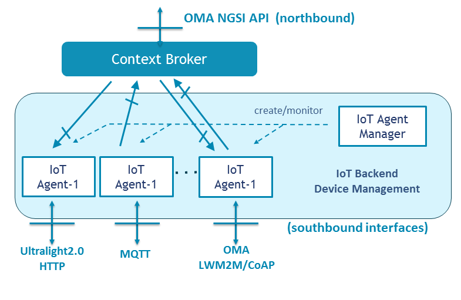

## Connection to the Internet of Things ##

Connecting “objects” or “things” involves the need to overcome a set of problems arising in the different layers of the communication model. Using its data or acting upon them requires interaction with a heterogeneous environment of devices running different protocols (due to the lack of globally accepted standards), dispersed and accessible through multiple wireless technologies.  

Devices have a lot of particularities so it is not feasible to provide a solution where one size fits all. They are resource constrained and can’t use full standard protocol stacks: they cannot transmit information too frequently due to battery drainage, they are not always reachable since they are connected through heterogeneous wireless networks, their communication protocols are too specific and lack integrated approach, and they use different data encoding languages, so it is tricky to find a global deployment.  

This compontents allow to simplify the management and integration of devices. It collects data from devices using heterogeneous protocols and translates them into standard platform language: NGSI entities.

It also allows to send commands to the devices, supportong both push and Pull modes. 

Tha platform supports several IoT protocols with a modular architecture where modules are called “IoT Agents”. Therefore, integrators need to determine first which protocol they will be using to connect devices and select the right IoT Agent. 

If you are interested in more details about how to connect your devices and sensros to the platform check out:

- [How to publish data from your IoT Devices](device_gateway_detail.md#publishing-data-from-your-iot-devices)
- [How to send commands to your IoT Devices](device_gateway_detail.md#acting-upon-devices)

 
At present, the following IoT Agents and supported IoT protocols are:

- [HTTP Ultralight 2.0](https://github.com/telefonicaid/fiware-IoTAgent-Cplusplus/blob/release/1.0.2/doc/UL20_protocol.md)
- [MQTT](https://github.com/telefonicaid/fiware-IoTAgent-Cplusplus/blob/release/1.0.2/doc/MQTT_protocol.md)
- [OMA LWM2M](https://github.com/telefonicaid/lightweightm2m-iotagent)
- [Thinking Things Open](https://github.com/telefonicaid/iotagent-thinking-things)

If the device uses a different protocol from the provided, it will be necessary to perform a translation between the device specific platform and the platform standard model (NGSI). For that, different IoT Agents development frameworks are provided: 

- [Node.js framework](https://github.com/telefonicaid/iotagent-node-lib)
- [IoT Agents C++ framework](https://github.com/telefonicaid/fiware-IoTAgent-Cplusplus)

In most of the supported IoT protocols, you will need a "secret key" that will be used by the platform to guarantee that devices are allowed to send data to the platform.

Specific device provisioning or registration is not required, unless you need to modify some specific parameters from the device (i.e. timezone, attributes mapping to Context Broker) or want to setup device commands.

Provisioning API is specified here:
 
- [IoT Agents Manager](http://docs.telefonicaiotiotagents.apiary.io/)

