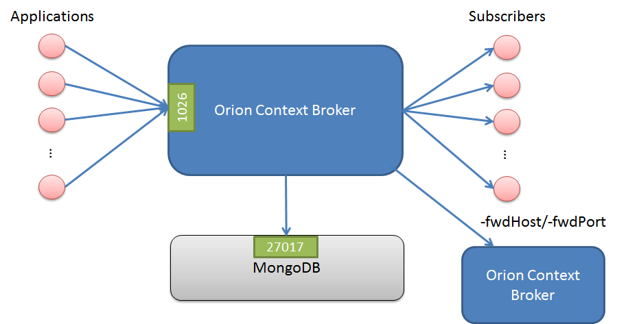

# Resources & I/O Flows

## Resources recommendations

Although we haven't done yet a precise profiling on Orion Context
Broker, tests done in our development and testing environment show that
a host with 2 CPU cores and 4 GB RAM is fine to run the ContextBroker
and MongoDB server. In fact, this is a rather conservative estimation,
Orion Context Broker could run fine also in systems with a lower
resources profile. The critical resource here is RAM memory, as MongoDB
performance is related to the amount of available RAM to map database
files into memory.

## Resource consumption

The most usual problems that Orion Context Broker may have are related
to abnormal consumption of memory due to leaks and disk exhaustion due
to growing log files.

Regarding abnormal consumption of memory, it can be detected by the the
following symptoms:

-   The broker crashes with a "Segmentation fault" error
-   The broker doesn't crash but stops processing requests, i.e. new
    requests "hang" as they never receive a response. Usually, the Orion
    Context Broker has only a fix set of permanent connections in use as
    shown below (several ones with the database server and the listening
    TCP socket in 1026 or in the port specified by "-port") but in the
    case of this problem each new request will appear as a new
    connection in use in the list. The same information can be checked
    using "ps axo pid,ppid,rss,vsz,nlwp,cmd" and looking to the number
    of threads (nlwp column), as a new thread is created per request but
    never released. In addition, you can check the broker log and see
    that the processing of new requests stops in the access to the
    MongoDB database (in fact, what is happening is that the MongoDB
    driver is requesting more dynamic memory to the OS but it doesn't
    get any and keeps waiting until some memory gets freed, which
    never happens).

```
$ sudo lsof -n -P -i TCP | grep contextBr
contextBr 7100      orion    6u  IPv4 6749369      0t0  TCP 127.0.0.1:45350->127.0.0.1:27017 (ESTABLISHED)
[As many connections to "->127.0.0.1:27017" as DB pool size, default value is 10]
contextBr 7100      orion    7u  IPv4 6749373      0t0  TCP *:1026 (LISTEN)
```

TBD: take into account how this looks like with persistent connections new in 0.23.0.

-   The consumption of memory shown by "top" command for the
    contextBroker process is abnormally high.

The solution to this problem is restarting the contextBroker, e.g.
`/etc/init.d/contextBroker restart`.

Regarding disk exhaustion due to growing log files, it can be detected
by the following symptoms:

-   The disk is full, e.g. `df -h` shows that the space available is 0%
-   The log file for the broker (usually found in the
    directory /var/log/contextBroker) is very big

The solutions for this problem are the following:

-   Stop the broker, remove the log file and start the broker again
-   Configure [log rotation](logs.md)
-   Reduce the log verbosity level, e.g. if you are using `-t 0-255` the
    log will grow very fast so, in case of problems, please avoid using
    unneeded trace levels.

## I/O flows

The Orion Context Broker uses the following flows:

-   From NGSI9/10 applications to the broker, using TCP port 1026 by
    default (this is overridden with "-port" option).
-   From the broker to subscribed applications, using the port specified
    by the application in the callback at subscription time.
-   From the broker to MongoDB database. In the case of running MongoDB
    in the same host as the broker, this is an internal flow (i.e. using
    the loopback interface). The standard port in MongoDB is 27017
    although that can be changed in the configuration. Intra-MongoDB
    flows (e.g. the synchronization between master and slaves in a
    replica set) are out of the scope of this section and not shown in
    the picture.

TBD: elaborate on persistent connections.

TBD: add element related with CPrs

Note that the throughput in these flows can not be estimated in advance,
as it depends completely on the amount of external connections from
context consumer and producers and the nature of the requests issued by
consumers/producers.


