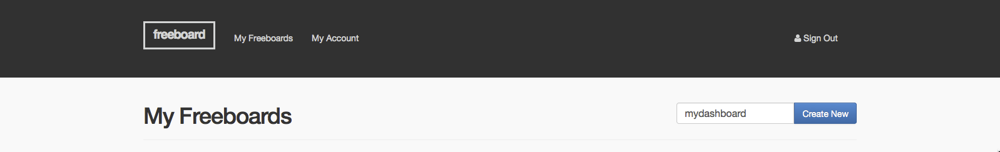
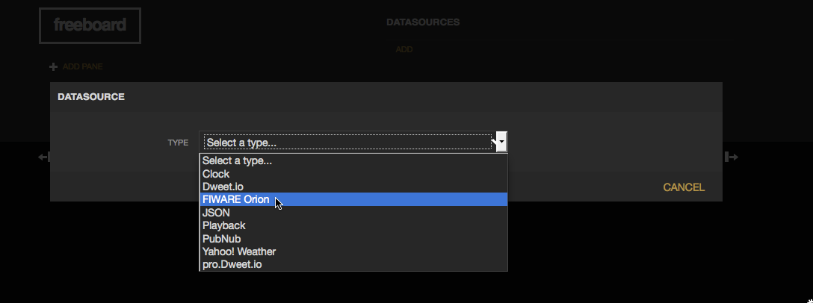
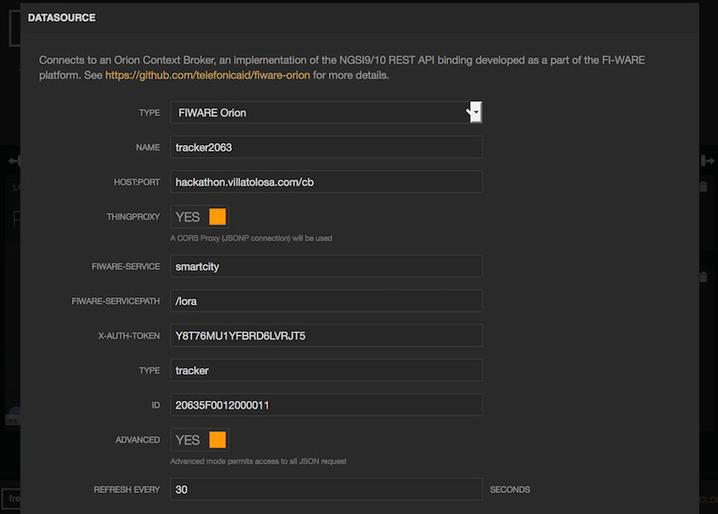

# Step 0 - Credentials

Please, request your credentials for your team at [fiware.d4m@orange.com](mailto:fiware.d4m@orange.com).
You will receive an email containing these fields that are required for the following steps:

<table cellpadding="10", border="1" >
  <tr>
    <th>Field name</th>
    <th>Description</th>
  </tr>
  <tr>
    <td>{{token}}      </td>
    <td>API Key used for applications to access data</td>
  </tr>
  <tr>
    <td>{{Fiware-Service}}      </td>
    <td>Service name</td>
  </tr>
  <tr>
    <td>{{Fiware-ServicePath}}      </td>
    <td>Sub-service name</td>
  </tr>
</table>

In order test the API, we really recommend you use the following sample
collection for [*POSTMAN extension for Google
Chrome*](https://chrome.google.com/webstore/detail/postman/fhbjgbiflinjbdggehcddcbncdddomop),
all this guide samples and some additional operations are there.

[*Fiware EMTECH Hackathon*](https://raw.githubusercontent.com/PascaleBorscia/fiware-iot-stack/master/docs/postman/Fiware%20EMTECH%20Hackathon.json.postman_collection)

Please, remember to create a POSTMAN environment with your credentials for this POSTMAN collection.You can modify this

[*Fiware EMTECH Hackathon Environment*](https://raw.githubusercontent.com/PascaleBorscia/fiware-iot-stack/master/docs/postman/Hackathon%20EMTECH.postman_environment)

# Step 1 - Send data

Before doing any coding, identify the sensors on your device and decide
which data do you want to send to the Cloud.

Sending data is as simple as sending an HTTP POST request using your API
key with your measures. Please use “\#” and “|” separators to split data
and measures.  

Please remember that you will need to send as query parameters on the URL your {{TOKEN}} and your device identifier.

<table cellpadding="10", border="1" >
  <tr>
    <th>HTTP method</th>
    <td>POST</td>
  </tr>
  <tr>
    <th>URL</th>
    <td>http://hackathon.villatolosa.com/ul/iot/d?i=myEdison&k={{TOKEN}}</td>
  </tr>
  <tr>
    <th>HTTP Headers</th>
    <td>-</td>
  </tr>
  <tr>
    <th>HTTP Body</th>
    <td>t|15.5\#p|1015\#g|40.516304/-3.661756\#a|"some-text"\#h|33.5</td>
  </tr>
</table>

Take into account that no device provisioning or data modeling is
required in advance to send your device data. Anyway, we recommend to
use short magnitude identifiers (like "t", "p" on the sample) to reduce
the message length sent from the device.

Your will simply receive an HTTP 200 OK response to confirm the data was
properly received at the Cloud.

# Step 2 - Get data

Your device data is now stored in the Cloud, lets get it via API.

 <table cellpadding="10", border="1" >
   <tr>
     <th>HTTP method</th>
     <td>GET</td>
   </tr>
   <tr>
     <th>URL</th>
     <td>http://hackathon.villatolosa.com/cb/v1/contextEntities/myEdison</td>
   </tr>
   <tr>
     <th>HTTP Headers</th>
     <td>-</td>
   </tr>
 </table>
 

You will get you device data in a json document like this that is FIWARE
NGSI compliant:

<table cellpadding="10", border="1" >
  <tr>
    <th>HTTP response code</th>
    <td>200</td>
  </tr>
  <tr>
    <th>HTTP response headers</th>
    <td>Content-Type: application/json</td>
  </tr>
  <tr>
    <th>HTTP Body</th>
    <td>
      {
                "contextElement": {
                         "type": "edison",
                          "isPattern": "false",
                          "id": "myEdison",
                         "attributes": [
                          {
                         "name": "TimeInstant",
                          "type": "ISO8601",
                          "value": "2015-06-25T14:13:54.953107"
                          }
                          [...]
                          ]
                         },
                         "statusCode": {
                         "code": "200",
                         "reasonPhrase": "OK"
                         }
      }    
      </td>
  </tr>
</table>

Please, notice that you will see one attribute per sensor.

### Step 4 - Show in a dashboard

JSON documents are fine, but dashboards are better for humans. If you want to create a responsive website to see your device data at the Cloud don’t do it from the scratch, just sign up at:

> [*https://freeboard.io/signup*](https://freeboard.io/signup)

After this, you will be able to create a dashboard:

Once your are at your new dashboard, create an Orion FIWARE datasource
per device.

On the FIWARE Orion datasource configuration introduce there your credentials and your device type and ID as retrieved on Step 2 from the Cloud API.

Now it’s time to add widgets to your dashboard, representing your device
data.

Anyway, you can always clone this sample freeboard and use it as a template for yours:

[*https://freeboard.io/board/HBEY35*](https://freeboard.io/board/HBEY35)

### Step 5 - Send commands

You can send commands to the device in order to trigger any action like
turning on a LED or a relay. In order to do so, you need to register your
device.

Remember that you can also setup your device via API, you will find an
example on the POSTMAN collection.

<table cellpadding="10", border="1" >
  <tr>
    <th>HTTP method</th>
    <td>POST</td>
  </tr>
  <tr>
    <th>URL</th>
    <td>http://hackathon.villatolosa.com/ul/iot/devices</td>
  </tr>
  <tr>
    <th>HTTP Headers</th>
    <td>-</td>
  </tr>
  <tr>
    <th>HTTP Body</th>
    <td>{
          "devices": [
            {
              "device_id": "myEdison",
              "entity_name": "myEdison",
              "entity_type": "edison",
              "protocol": "PDI-IoTA-UltraLight",
              "attributes": [
                {
                  "object_id": "l",
                  "name": "lux",
                  "type": "string"
                },
                {
                  "object_id": "p",
                  "name": "button",
                  "type": "string"
                }
              ],
              "commands": [
                {
                  "name": "SET",
                  "type": "command",
                  "value": "myEdison@ledr|%s"
                }
              ]
            }
          ]
        }
    </td>
  </tr>
</table>

Once the command is configured, you can send commands to the device just
updating the entity attribute associated to that command.

The commands will be received on the device endpoint if configured on
the device setup. Remember that if you left that field empty, the
commands can be pulled directly from the device:

<table cellpadding="10", border="1" >
  <tr>
    <th>HTTP method</th>
    <td>GET</td>
  </tr>
  <tr>
    <th>URL</th>
    <td>http://hackathon.villatolosa.com:8080/iot/d?i=myEdison&k={{TOKEN}}</td>
  </tr>
  <tr>
    <th>HTTP headers</th>
    <td>-</td>
  </tr>
</table>

The command received will be as follows:

<table cellpadding="10", border="1" >
  <tr>
    <th>HTTP Response code</th>
    <td>200</td>
  </tr>
  <tr>
    <th>HTTP Body</th>
    <td>device\_id@{{command\_name}}|{{comand\_params}}</td>
  </tr>
</table>

# In more detail …

**Sending data**

Devices can provide data using many other protocols like MQTT or COAP,
it is also feasible to set different timestamps, configure customized
mappings between physical device and virtual entity, or provision
measures via HTTP GET. Read the full detail at:

More info: [Device API guide](device_api.md)

**Data API**

Data API is FIWARE NGSI compliant so it provides lots of
features: subscriptions, partial updates, bulk entities retrieval,
regular expression queries, geolocated entities search.

[*http://es.slideshare.net/fermingalan/fiware-managing-context-information-at-large-scale*](http://es.slideshare.net/fermingalan/fiware-managing-context-information-at-large-scale)

More info: [Data API guide](data_api.md)

**Historic Data API**

Historic data is accessible using the Short Term historic API.

** RAW data query example **

<table cellpadding="10", border="1" >
  <tr>
    <th>HTTP method</th>
    <td>GET</td>
  </tr>
  <tr>
    <th>URL</th>
    <td>http://hackathon.villatolosa.com/sth/type/device/id/device:mydevice/attributes/h?lastN=10</td>
  </tr>
  <tr>
    <th>HTTP headers</th>
    <td>Accept: application/json ; Fiware-Service: {{Fiware-Service}} ; Fiware-ServicePath: {{Fiware-ServicePath}} ; X-Auth-Token: {{user-token}}</td>
  </tr>
</table>

**Aggregated data (sum/hourly) query example **

<table cellpadding="10", border="1" >
  <tr>
    <th>HTTP method</th>
    <td>GET</td>
  </tr>
  <tr>
    <th>URL</th>
    <td>
    http://hackathon.villatolosa.com/sth/type/edison/id/myEdison/attributes/h?aggrMethod=sum&aggrPeriod=hour&dateFrom=2015-02-22T00:00:00.000Z&dateTo=2016-01-22T23:00:00.000Z
    http://hackathon.villatolosa.com/STH/type/type/device/id/myEdison/attributes/h?lastN=10</td>
  </tr>
  <tr>
    <th>HTTP headers</th>
    <td>Accept: application/json ; Fiware-Service: {{Fiware-Service}} ; Fiware-ServicePath: {{Fiware-ServicePath}} ; X-Auth-Token: {{user-token}}</td>
  </tr>
</table>

>> Remember that in order to collect historic data, it is necessary to
>> configure the required subscription (endpoint:
>> http://hackathon.villatolosa.com/sth/notify).

More info: [Historic Data API](historicdata_api.md)
