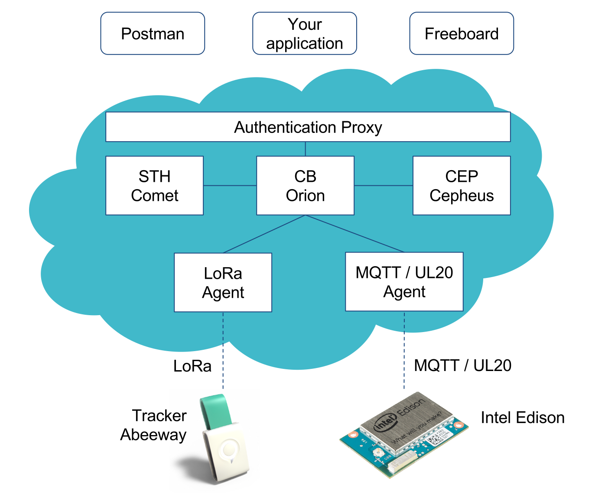

For the EMTECH hackathon, a simplified version of the FIWARE IoT Stack has been deployed.

## Authentication proxy

All components are only accessible behind an HTTP authentication proxy which checks
for `Fiware-Service`, `Fiware-ServicePath` and `X-Auth-Token` headers.

Requests with invalid headers are rejected by the proxy.

## Base URL of the components

All the components are hosted at the `hackathon.villatolosa.com`.

* Orion Context Broker: `http://hackathon.villatolosa.com/cb`
* Comos STH: `http://hackathon.villatolosa.com/sth`
* UL and MQTT agent: `http://hackathon.villatolosa.com/ul`
* Cepheus CEP: `http://hackathon.villatolosa.com/cep`

Note: the Lora Agent is not exposed as all interactions are done through the Orion Context Broker.

Note: the MQTT broker is exposed on port `1883`.
